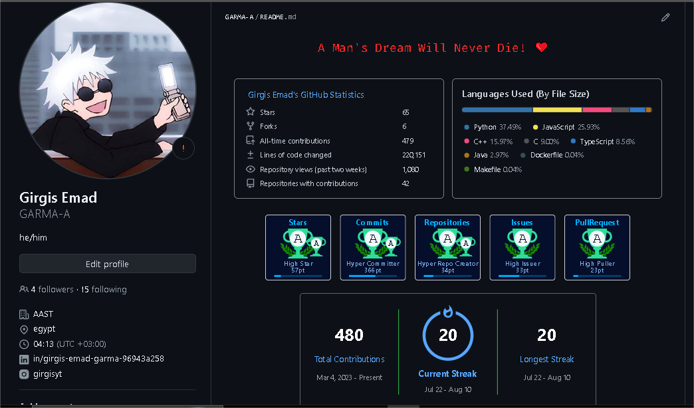

# **How To write a Message On GitHub**

# h1

## h2

### h3

#### h4

##### h5

###### h6

```yaml
# h1
## h2
### h3
#### h4
##### h5
###### h6
```

<hr/>

normall text **Bold Text** _italic Text_ **_Bold Italic Text_** ~~line throw~~

```yaml
noraml text  **Bold Text**  *italic Text*
***Bold Italic Text*** ~~line throw~~
```

## making a unorderd list

- first
- second
  - subitem1
  - subitem2
- third

```yaml
- first
- second
  - subitem1
  - subitem2
- third
```

## making ordered list

1. first
   1. sub1
   2. sub2
   3. sub2
2. second
3. third

```yaml
1. first
   1. sub1
   2. sub2
   3. sub2
2. second
3. third
```

## CheckBoxes

- [ ] this is not complete yet
- [x] this is complete

```yaml
- [ ] this is not complete yet
- [x] this is complete
```

## Links

[Link to Google HomePage](https://google.com/)

```yaml
[Link to Google HomePage](https://google.com/)
```

## How to include Imgs



## The code for displaying the img

```

```

## If you want to resize the image


## You can use simple HTML code

```html

```

## Table

| column1 | column2 |
| :------ | ------: |
| row1 a  |  row1 b |
| row1 a  |  row1 b |
| row3 a  |  row3 b |
| row4 a  |  row4 b |

```yaml
| column1 | column2 |
|:---|---:|
|row1 a | row1 b
|row1 a | row1 b
|row3 a | row3 b
|row3 a | row3 b
```

### For Center Table Content

```yaml
| column1 | column2 |
|:---:|:---:|
|row1 a | row1 b
|row1 a | row1 b
|row3 a | row3 b
|row3 a | row3 b

```

### highlight some Text

this is the `console.table()` in javascript
show's the data like that

```yaml
┌─────────┬───────────┬─────┬─────────────────┐
│ (index) │   name    │ age │      city       │
├─────────┼───────────┼─────┼─────────────────┤
│    0    │  'Alice'  │ 25  │   'New York'    │
│    1    │   'Bob'   │ 30  │ 'San Francisco' │
│    2    │ 'Charlie' │ 35  │    'Chicago'    │
└─────────┴───────────┴─────┴─────────────────┘
```

### highlighted Text code

```yaml
`console.table()`
```

### Show differences you made in the code

```diff
- const data = [];
+ const data = {};
```

### the code

#### ```diff

#### - const data = [];

#### + const data = {};

#### ```

### Reply to specific message

#### **Ihave idea 1 that is lab lab laaaa....**

#### **also idea 2 that is lab lab laaaa....**

<hr/>

> Ihave idea 1 that is lab lab laaaa....

### i think i agree with this

> also idea 2 that is lab lab laaaa also....

### i dont agree with that

```yaml
> Ihave idea 1 that is lab lab laaaa....

### i think i agree with this

> also idea 2 that is lab lab laaaa also....

### i dont agree with that

```

# **The Most Important Git Commmands**


## **`git log`**

#### **`git shortlog` summary version `git log main..Feature/Branch` show only feature branch commits**

#### **`git log --stat` describing version**

#### **`-n 2` show first two `-p` normal log + diff**
#### **`--author=name` all logs for one person `--grep="bug fix"` all logs with this words**
#### **`--since="2024-01-01"` `--until="2024-01-31"`**
#### **`--merges`show only merge commits `--no-merges` all commits but without merge commits**

<hr/>

## **`git rm filePath` or `.` or `*.txt`**
#### **will Delete the file(all files) from workingTree & stagingArea & gitRepo like you normally delete it**
#### **`--cached filePath`make the file untracked do not delete it just untracked**
#### **you can use `-r` to rm folder**
<hr/>

## **`git mv`**
#### **`file.txt renamed_file.txt`with this context will rename the file**
#### **`file1.txt file2.txt new_folder/`move the files inside the new_folder/**


<hr/>

## **`git ls-files`**

#### **will list all the files that are currently being tracked by Git in the repository.**

#### **`--stage` list to files in the stage area**

#### **`--others` list untracked files**

#### **`--others --exclude-standard` list untracked files but remove from it .gitignore**

<hr/>

## **`git checkout-index -a`**
#### **overwrite your working tree with the staging changes(-a stand for all)**
<hr/>

## **`git checkout .`**

#### **will look for the last saved changes on staging area first then on last commit**
#### **and overwrite the working tree**
<hr/>

## **`git checkout -- . (git restore .)`**
#### **Both discards changes in all files in the working directory, restoring them to the last committed state**

<hr/>

## **`git restore --staged . (git reset HEAD .)`**
#### **Both will remove all your files from staging area but keep the changes in worktree**

<hr/>

## **`git restore`**
#### **`--source=commit-hash <file-path>`this option restore a file to specific commit**
#### **`--source=<commit-hash> --staged --worktree .`this options restore all your working tree and staging area to specific commit**

## **`git reset commit-hash`**
#### **remove all commits that comes after the provided commit in the code**
#### **and puth all changes related to provided commit in staging area**
#### **`--soft` do not put changes in staging area (do not put any where just remove commits with current changes saved)**
#### **`--hard` will put directly in working tree and not staging area**

<hr/>

## **`git revert commit-hash`**
#### **create new commit with opposite changes introduced in that commit**

<hr/>

## **`git checkout -b branch-name (git switch -c branch-name)`**
#### **Both create and go to the new-branch**
#### **without '-b' you will just switch to existing branch or without(-c) in switch**
<hr/>

## **`git checkout commit-hash`**
#### **Move to that commit and change worktree to that commit. WARNING! you are in`detached HEAD`**
#### **`detached HEAD` this mean there is no branch point to this commit so if you made new commits from this point**
#### **The prefer way is to use (git checkout -b new-branch-name) to make branch point to it so that it easly can return to it**
#### **if you don't do that and return to the main branch the only way to return to this commits is from reflog**
#### **`git branch -f existing-branch` another way is to force existing branch to point to current commit**


<hr/>

## **`git remote`**
#### **`add origin https://github.com/myrepo.com`will add this url as remote repo named origin**
#### **`remove origin`will remove the remote branch**

<hr/>

## **`git branch`**
#### **`--set-upstream-to=origin/main`manually set the upstream remote to your local branch**
#### **`--unset-upstream`manually discard the upstream to your current branch**
#### **`-v`list to you the remote branches `-vv` list the remotes with the upstreams**
#### **`-d` delete the branch after merge it or `-D` if it not merge yet but you sure you want to delete it**
<hr/>


## **`git push -u origin branch-name`**

#### **after create your local branch you can push it to remote that way(create new branch in remote)**

<hr/>

## **`git push origin --delete branch-name`**

#### **allow you to delete remote branch**

<hr/>

## **`git push --force`**

#### **this will push even if you change the history**

#### **like you pull and then do rebase -i and push this**

#### **not allowing because you change the history that**

#### **in the remote but now you can**

<hr/>

## **`git push --force-with-lease`**

#### **will check first if the last commmit in the remote is**

#### **yours so you dont delete work of any body else**

### **VERY VERY GREAT OPTION**

<hr/>

## **`git add -p fileName`**

#### **will ask you in each connected chunck of lines if**

#### **you want to add them to staging area or not**

#### **so you can add half of the file to this commit and**

#### **another half to the second commit this usefal if there is more**

#### **that one edit the same file so you need to take just your**

#### **own changes to cur commit**

<hr/>

## **`git cherry-pick commit-hash1 commit-hash2`**

#### **create new commits that have this changes on top of your current commits**
#### **`--no-commit` will apply directly the changes to your working tree and staging them also(no new commits)**

<hr/>

## **`git cherry-pick commit-hash1^..commit-hash2`**

#### **you can add range of commits also to add to your current branch**

<hr/>

## **`git diff`**

#### **Default Behavior: If you run git diff without any arguments,**

#### **it compares the working directory to the staging area.**

#### **Empty Staging Area: If there are no changes staged, git diff will show the differences**

#### **between the working directory and the last commit because it’s effectively comparing the**

#### **untracked changes in the working directory to the last committed state.**

<hr/>

## **`git diff HEAD`**

#### **compares the staging and not staged changes to the last commit (HEAD).**

<hr/>

## **`git diff --cached or (git diff --staged)`**

#### **shows the differences between the staged changes and the last commit.**

<hr/>

## **`git branch --set-upstream-to=origin/main feature-branch`**

#### **manually set up a branch in Git to track a remote branch**

<hr/>

## **`git branch --unset-upstream`**

#### **remove the tracking relationship between a local branch and a remote branch in Git**

<hr/>

## **`git tag -d my-tag`**
#### **Delete the old tag**
<hr/>

## **`git tag my-tag`**
#### **Recreate the tag**
<hr/>

## **`git push --force origin my-tag`**
#### **Force push the updated tag to the remote repository (if needed)**

## ** `git blame fileName`
#### **give you line by line tell you the commit that line saved into who write that line and the date**


